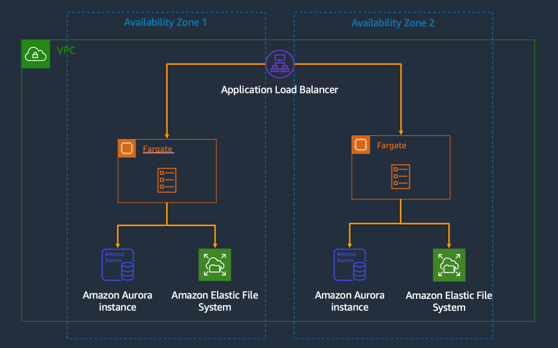

# Wordpress on Amazon ECS Fargate

This repository uses the [AWS Cloud Development Kit](https://aws.amazon.com/cdk/) (CDK) to deploy a highly available Wordpress installation on [AWS Fargate](https://aws.amazon.com/fargate/) on [Amazon ECS](https://aws.amazon.com/ecs/). This will provision a VPC, ECS Cluster, EFS Filesystem, Secrets, Aurora, and Wordpress Containers.



To deploy Wordpress we use the official [Wordpress container image](https://hub.docker.com/_/wordpress) available on Docker hub. This image is configured using a volume mount for persistent storage and a series of envrionment variables from AWS Secrets Manager.

Wordpress has shared resources such as plugins, themes, and uploads that all containers need access to in order to function properly. To facilitate this storage, we provision an Amazon Elastic Filesystem (EFS) filesystem that is attached to all of the containers running.

Next, we use AWS Secrets Manager to store database credentials for the Aurora MySQL Database and to generate the [Wordpress Salts](https://api.wordpress.org/secret-key/1.1/salt/). These also need to be mounted to every container.

## Usage

This repository is built on AWS Cloud Development Kit (CDK). For full guidance on using the CDK, see the CDK documentation.

```bash
# install the depdencies
npm install

# deploy the stack
cdk deploy

# destroy the stack
cdk destroy
```

## License

This library is licensed under the MIT-0 License. See the [LICENSE file](./LICENSE).
